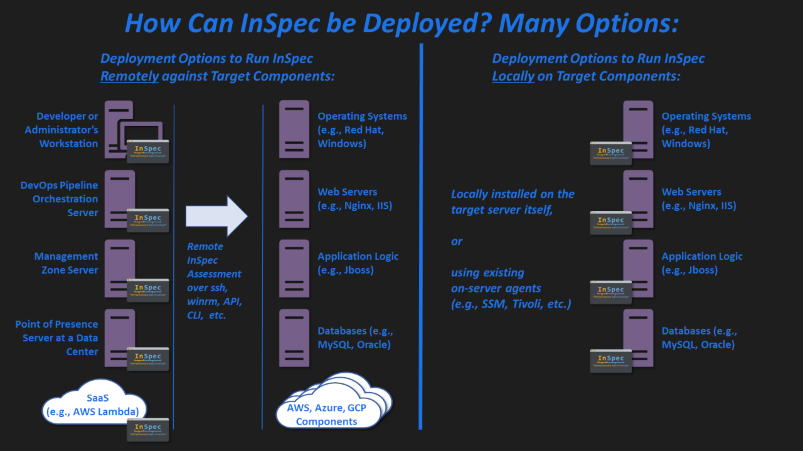

## 5. Decide the most appropriate way to set up your InSpec runner for your assessment https://saf.mitre.org/#/faq#runners

It is intended and recommended that InSpec be installed on a "runner" host (such as a DevOps orchestration server, an administrative management system, or a developer's workstation/laptop) and run against the target remotely. However, InSpec may be deployed in various ways depending on the needs of the user:

